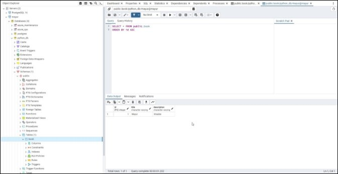

**Assignment – 1**

**API Development and Cloud Infrastructure**

Problem Statement - Design and implement 4 simple CRUD APIs using Python FastAPI, integrating it with a PostgreSQL database. Deploy the API on Azure cloud infrastructure and provide step-by-step documentation of the deployment process. Also, ensure the API is secure and scalable.

1)  Go to my github profile and clone the code - <https://github.com/bashlogs/FastAPI-CRED.git>

2)  Create a PostgreSQL Server

3)  Build a container registery and deploy the application

**Create a PostgreSQL Server**

Go to Azure database for PostgreSQL servers

Click on create and fill the information’s and choose the workload type depending upon your use

I am using free tier development workload.

Select authentication method for PostgreSQL Login

Give Access to all IP address

Check the details once again and create the server

We can add this firewall later so continue server without firewall rules

Wait for few minutes to complete deployment process

Once the server is deployed go the networking and give public access to the current client IP address

After this go to the databases -> Click on Add -> Create a database “python\_db”

Once the database is created click on connect option azure shell will pop up

In that azure shell you will see the username, host,  port and dbname note down that information

**Now let’s connect azure database to our local pgadmin4**

Go to server menu and click on register new server and enter host name

For ex:-  HostName = “john.postgres.database.azure.com” Then name =  john

The go to connection tab and enter hostname, port, database and username with password

Click on save and your server will be register

Server register successfully

If you go to table their will be no table now run the fastapi application with given readme instructions.

Execute a create query.

Refresh the table you will see entry of create query.

**Deploy the application in container registry**

Go to container registry and enter the registry name

Skip the networking and encryption tabs

Check the details and create the container

Container is successfully created

Once the container created go to the Access key tab and enable admin access

Next step is to go terminal and do docker login

Commands : 

docker login <login\_server> -u <username> -p <password>

docker build -t mayurkhadde.azurecr.io/fastapi:1.0 .

Application successfully deployed

Go to the repositories and see if the application deployed

**

**Create a container instance**

Go to the container instance and create instance

Enter same repository name to the container name and select image source as azure container registry

FastAPI Application runs on the 8000 port so enter that port number in networking

Enter your environment variables in advanced tab

Review the things and create the instance

Container instance is created successfully

If you don’t see any red or orange label then your instance is running fine

Select the public IP address and check if the API is running or not

Application is running

Try to execute select query

Once you perform all this step you application will be running perfectly fine

